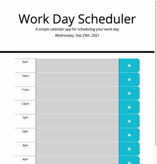

# work-day-scheduler

Homework #5 - Work Day Scheduler

# what did i do?

This assignment included making a daily calendar for a user to organize their day by the hour. There is a text field avaialble for each hour that can be filled in with text. The user can then save their entry by clicking the disk icon.

In addition to saving information, the calendar is also color coated based on the time of day it is. This was done using Momentjs.

# what do i need to explain?

When the user clicks to save their information, all fields are saved at once. I chose to build it this way because I am not telling the user that they have saved a particular entry. I feel the user will have a better experience if all of their info is saved each time they hit save.

# github pages link

https://bretpeters3n.github.io/work-day-scheduler/

# screenshot of final product

